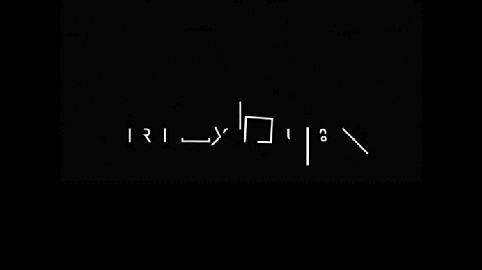

<td valign="top">
<h1>Gabriel da Silva Martins</h1>

Graduando em <b>Engenharia da Computação</b> (Senac – Santo Amaro) • Conclusão prevista: <b>2029</b> 
São Paulo – SP • Em busca de <b>estágio</b> (Eng. da Computação / TI / Desenvolvimento)

&nbsp;&nbsp;

&nbsp;&nbsp;

</td>
</tr>
</table>

<h2>Sobre mim</h2>

Sou graduando em Engenharia da Computação com foco em <b>engenharia aplicada</b>: programação, automação e prototipagem. 
Desenvolvo projetos integrando <b>software e hardware</b> (sensores, atuadores e controle) e também realizo automações/análises em Python. 
Utilizo <b>AutoCAD</b> para desenho técnico e documentação, seguindo uma rotina de engenharia: requisitos → implementação → testes → registro de resultados.

<h2>Tecnologias</h2>

<h2>Projetos em destaque</h2>

<table>
<tr>
<td valign="top" width="50%">
<h3>RoboCar-Mini — carrinho autônomo</h3>

Protótipo de robótica educacional com desvio de obstáculos usando sensor ultrassônico,
servo para varredura e controle PWM de motores.

&nbsp;

</td>

<td valign="top" width="50%">
<h3>QRCODESenac — projeto com Flask</h3>

Aplicação web em Python/Flask com rotas e arquivos estáticos, executando localmente.
Projeto em colaboração (repositório do Diego).

</td>
</tr>

<tr>
<td valign="top" width="50%">
<h3>Cálculos do volume da esfera</h3>

Projeto acadêmico com cálculo e automação para organizar resultados e validações.

</td>

<td valign="top" width="50%">
<h3>JOGO-RPG</h3>

Projeto pessoal para estudo e prática (estrutura do projeto e experimentos).

</td>
</tr>
</table>

<h2>Estatísticas (opcional)</h2>

Notas

<ul>
<li>Para fixar os projetos no seu perfil, use a seção <b>Pinned</b> do GitHub (complementa o README).</li>
<li>GitHub Pages é útil para um site completo, mas este README já resolve o objetivo de “aparecer tudo na tela do GitHub”.</li>
</ul>

